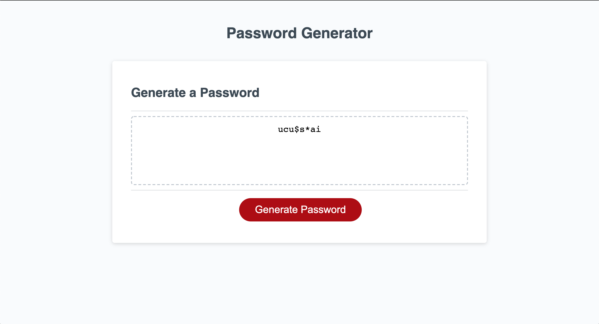
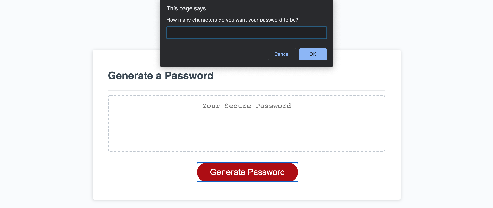

# Password Generator

## The Repository 
This Repository is where Ian Fletcher's Random Password Generator is housed.

## Installation
In order to acess and refractor the code you must first go through the Installation Process.

1) Open GitHub and navigate to the main repository 

2) Click the green "Code" button Above the top right corner of the files 

3) To clone the repository using HTTPS, under "Clone with HTTPS", click the clipboard icon. To clone the repository using an SSH key, including a certificate issued by your organization's SSH certificate authority, click "Use SSH", then click the clipboard icon. To clone a repository using GitHub CLI, click "Use GitHub CLI", then click the clipboard icon.

4) Open Terminal and navigate to the directory where you want the repository to be 

5) Type "git clone ", and then paste the SSH, CLI, or HTTPS link you coppied on GitHub and press ENTER 

This should put a copy of the repository into the directory you had chosen in step 1

## Usage
This application should allow users to easily generate a random password. First the app prompts the user with a variety of criteria that the user may want in their password. It then creates a random password that is between 8 and 128 characters long from the critera selected. If a user accidentally enters in a password length that is not a number or does not choose any criteria for the password to be chosen from the site re-prompts the user to enter the information. The user will be able to clear an old password and generate a new passowrd by re-pressing the "Generate Password" button.

[Check Out The Full Page](https://ianfletcher314.github.io/PasswordGenerator/)

## Credits

- [GitHub's Document on Cloning Repositories (used in Instalation section)](https://docs.github.com/en/github/creating-cloning-and-archiving-repositories/cloning-a-repository) 
- [VS Code's ReadMe Page (used for formating and licensing syntax)](https://github.com/microsoft/vscode/blob/master/README.md)

## License 

Copyright (c) Horision SSS Inc. All Rights Reserved.

Licensed under the [MIT](license.txt) license
